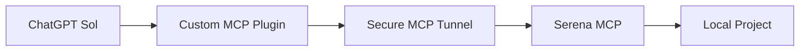

# ChatGPT Serena Manager

**ChatGPT Sol + Serena สำหรับใช้แทน Codex ในการทำงานกับ Local Project บน Windows**

Serena Manager เป็นเครื่องมือสำหรับเปิด/ปิด Serena MCP และ Secure MCP Tunnel ของหลาย project จากหน้าต่างเดียวบน Windows

เมื่อเชื่อมกับ ChatGPT แล้ว สามารถให้ ChatGPT อ่านโค้ด ค้นหา symbol แก้ไฟล์ ตรวจ diagnostics และรันคำสั่งใน local project ผ่าน Serena tools ได้

> โปรเจกต์นี้เป็น community / personal tool และไม่ได้เป็นผลิตภัณฑ์อย่างเป็นทางการของ OpenAI หรือ Serena


*ตัวอย่างหน้าจอ Serena Manager สำหรับจัดการหลาย project*

## ทำไมถึงมีโปรเจกต์นี้

เมื่อใช้ Serena กับหลาย local project จะต้องจัดการ Serena MCP server, Secure MCP Tunnel, port, launcher และสถานะของแต่ละ project แยกกัน

Serena Manager รวมงานเหล่านี้ไว้ใน GUI เดียว เพื่อให้เลือก project ที่ต้องการแล้ว Start, Stop หรือดูสถานะได้สะดวกขึ้น

ภาพรวม workflow:



## ใช้ทำอะไรได้บ้าง

- จัดการ Serena หลาย project จากหน้าต่างเดียว
- Start / Stop / Restart project ที่เลือก
- ดูสถานะ Serena และ Tunnel แยกกัน
- ดู MCP Port และ Health Port
- เพิ่ม project ใหม่จาก GUI พร้อมสร้าง launcher และ tunnel profile ในเครื่อง
- เปิด Debug launcher และ launcher log
- รัน normal start แบบ hidden/background
- จำลำดับ project ที่ลากเรียงไว้
- เชื่อม workflow เข้ากับ ChatGPT ผ่าน Custom MCP Plugin

## ตัวอย่างการใช้งานกับ ChatGPT

เมื่อ project ขึ้นพร้อมแล้ว ChatGPT สามารถใช้ Serena tools เพื่อทำงานกับ source ในเครื่องได้ ตัวอย่าง prompt:

```text
เช็ก Serena my-project
```

```text
ช่วยดู architecture ของ project นี้
```

```text
หา function ที่เกี่ยวกับ login แล้วอธิบาย flow ให้หน่อย
```

```text
ช่วยแก้ bug นี้ แล้วตรวจ references ที่เกี่ยวข้องก่อน
```

```text
หลังแก้ช่วยเช็ก diagnostics และ run test ที่เกี่ยวข้อง
```

ก่อนให้ ChatGPT แก้โค้ด ควรสั่งให้ตรวจ Active project ทุกครั้ง เพื่อป้องกันการทำงานผิด folder

## สิ่งที่ต้องมี

- Windows 10 / 11
- Python
- Node.js
- Serena
- Secure MCP Tunnel client
- ChatGPT ที่รองรับ Custom MCP / Plugins
- Git (แนะนำ แต่ไม่จำเป็นสำหรับการเปิด Serena Manager)

## การติดตั้งแบบเร็ว

### 1. Clone repository

```cmd
git clone <repo-url>
cd chatgpt-serena-manager
```

### 2. เตรียม Serena, Node.js และ Tunnel client

Serena Manager ใช้ Python standard library จึงไม่มี Python package เพิ่มที่ต้องติดตั้งจาก `requirements.txt` ดูขั้นตอนติดตั้งแบบละเอียดได้ที่ [Installation](docs/INSTALLATION.md)

### 3. เปิด Serena Manager

เปิดไฟล์นี้จากโฟลเดอร์ project:

```text
Start-Serena-Manager.cmd
```

## เพิ่ม Project แรก

1. กดปุ่ม `+`
2. เลือก folder ของ project
3. ใส่ Tunnel ID ของตัวเอง
4. ตรวจชื่อ project และ port ที่ระบบเลือก
5. กด Create
6. เลือก project ที่เพิ่งเพิ่ม
7. กด Start

เมื่อพร้อม ควรเห็นสถานะนี้:

```text
Serena: RUNNING
Tunnel: RUNNING
Status: RUNNING
```

ถ้า Serena ขึ้น แต่ Tunnel ยังไม่ขึ้น สถานะจะเป็น `PARTIAL` ดูแนวทางแก้ได้ที่ [Troubleshooting](docs/TROUBLESHOOTING.md)

## เชื่อมกับ ChatGPT

ก่อนสร้างหรือใช้งาน Plugin ต้อง Start project ก่อน และตรวจให้เห็น:

```text
Serena = RUNNING
Tunnel = RUNNING
Status = RUNNING
```

จากนั้นใน ChatGPT:

```text
Settings
→ Plugins
→ Add/Create custom MCP
→ เลือก Tunnel
→ เลือก Authentication ตาม setup ของคุณ
→ ยอมรับคำเตือน Custom MCP
→ Create
```

ใช้ Tunnel ID ของตัวเองเท่านั้น ตัวอย่างนี้เป็น placeholder:

```text
tunnel_xxxxxxxxxxxxxxxxx
```

หากกด Create Plugin ตอน Serena หรือ Tunnel ยัง `STOPPED` อาจพบข้อความ `Error creating connector`

## วิธีใช้งานประจำวัน

1. เปิด Serena Manager
2. Start project ที่ต้องการ
3. เช็กว่า `RUNNING / RUNNING / RUNNING`
4. เปิด ChatGPT
5. เลือกหรือเปิด Plugin ของ project นั้น
6. สั่ง ChatGPT ให้เช็ก Active project
7. เริ่มอ่านหรือแก้ code
8. เมื่อเลิกใช้ กด Stop

## 🔐 เรื่องความปลอดภัย

อย่า commit หรือแชร์สิ่งเหล่านี้:

- API key
- DPAPI credential
- Tunnel ID จริง
- tunnel profile
- `.env`
- private key
- logs ที่มีข้อมูลส่วนตัว

repository นี้ออกแบบให้ credential อยู่ local เท่านั้น แต่ควรตรวจ `git status` ก่อน commit ทุกครั้ง ดูรายละเอียดเพิ่มได้ที่ [Security](docs/SECURITY.md)

## Troubleshooting แบบย่อ

### Node.js not found

```cmd
node -v
npm -v
where node
```

ถ้าเพิ่งติดตั้ง Node.js ให้ปิด Serena Manager แล้วเปิดใหม่

### Status = PARTIAL

หมายถึง Serena หรือ Tunnel ตัวใดตัวหนึ่งยังไม่พร้อม เปิด log ของ project นั้นและตรวจสถานะทั้งสองส่วนแยกกัน

### Plugin สร้างไม่ได้

Start Serena และ Tunnel ก่อน แล้วรอให้สถานะเป็น `RUNNING / RUNNING / RUNNING`

### Port ชน

ตรวจว่าไม่มี project อื่นหรือ process อื่นใช้ MCP Port หรือ Health Port เดียวกัน

ดูปัญหาเพิ่มเติมที่ [Troubleshooting](docs/TROUBLESHOOTING.md)

## เอกสารเพิ่มเติม

- [Installation](docs/INSTALLATION.md)
- [Usage](docs/USAGE.md)
- [Troubleshooting](docs/TROUBLESHOOTING.md)
- [Security](docs/SECURITY.md)
