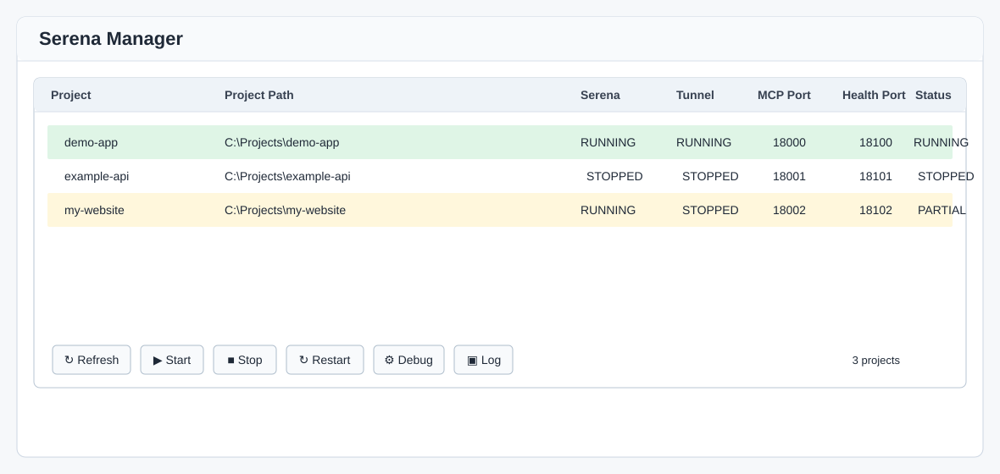
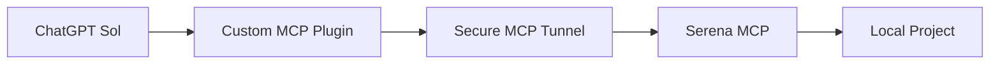

# Serena Manager

**ChatGPT Sol + Serena สำหรับใช้แทน Codex**

Use ChatGPT with Serena MCP to work directly with local code projects. Serena Manager is an independent Windows community tool; it is not an official OpenAI or Serena product.



## Overview

Serena Manager starts, stops, restarts, and observes multiple local Serena MCP projects and their Secure MCP Tunnel processes. It discovers project launchers, shows MCP and health ports, provides debug and log access, and can create or safely remove Manager-owned project setup.

## How it works



## Features

- Manage multiple Serena projects in one Windows UI
- Start, stop, restart, and debug a selected project
- Show Serena, tunnel, MCP port, health port, and combined status
- Run normal launches hidden in the background
- Open per-project launcher logs
- Add projects with generated launchers and tunnel profile
- Safely remove only projects created by the Manager
- Persist drag-and-drop project ordering per user

## Requirements

- Windows 10 or Windows 11
- Python 3 with Tkinter and the `pyw.exe` launcher
- Serena installed and available on `PATH` as `serena`
- A Secure MCP Tunnel client installed locally
- A local control-plane API key stored only on your computer
- A ChatGPT account and product configuration that supports your custom MCP/plugin workflow

## Installation

Read the Windows-first [installation guide](docs/INSTALLATION.md). The Manager itself has no third-party Python package dependency; `requirements.txt` documents that fact.

## First project setup

1. Open Serena Manager with `Start-Serena-Manager.cmd`.
2. Select **+** (Add).
3. Choose an existing local project folder, set the project name, and enter **your own** tunnel ID.
4. Review the selected MCP and health ports, then select **Create**.
5. Wait for the setup validation to finish. The Manager leaves the new project stopped.

The generated configuration grants Serena write capability (`read_only: false`). Connect only projects you trust and review changes before accepting them.

## ChatGPT plugin setup

Start the project first. Before creating or using a custom MCP plugin, verify that both **Serena** and **Tunnel** display **RUNNING**.

In ChatGPT, open Settings, then Plugins, and create/add a custom MCP plugin for your tunnel. Use the authentication option required by your tunnel setup; many local configurations use **No Auth**. Accept the custom MCP warning only after checking the selected project and tunnel.

Use placeholders in examples only:

```text
tunnel_xxxxxxxxxxxxxxxxx
```

Never publish a real tunnel ID, API key, DPAPI credential file, or generated tunnel profile.

## Using it with ChatGPT

Examples:

- `เช็ก Serena my-project`
- `อ่าน architecture ของ project นี้`
- `หา function ที่รับผิดชอบ login`
- `แก้ bug นี้โดยตรวจ references ก่อน`
- `ตรวจ diagnostics หลังแก้`

Ask ChatGPT to verify the active Serena project before it reads or changes code.

## Typical workflow

`Start project → confirm RUNNING → connect plugin → verify active project → inspect → edit → test → stop when finished`

See [Usage](docs/USAGE.md), [Troubleshooting](docs/TROUBLESHOOTING.md), and [Security](docs/SECURITY.md) for details.

## Security

**Never commit your API key, DPAPI credential file, tunnel ID, generated profile, or logs.** The repository `.gitignore` excludes common local runtime artifacts, but inspect `git status` before every commit.

Custom MCP access can read and write local project files. Use least privilege, connect only trusted repositories, and review generated launchers/configuration before use.
